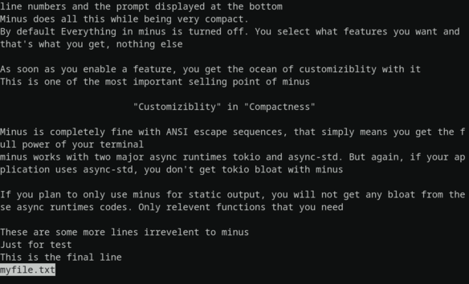

# minus

<p align="center">
    
</p>

[](https://crates.io/crates/minus)
[](https://github.com/arijit79/minus/actions/workflows/ci.yml)
[](https://docs.rs/minus)
[](https://discord.gg/FKEnDPE6Bv)
[](https://matrix.to/#/!hfVLHlAlRLnAMdKdjK:matrix.org?via=matrix.org)
[](https://github.com/arijit79/minus#license)

minus is an asynchronous terminal paging library written in Rust.

<p align="center">
    
</p>

## What is a Pager?

A pager is a program that lets you view and scroll through large amounts of text using a keyboard in a TTY where no mouse support is available.

Nowadays most people use a graphical terminals where mouse support is present but they aren't as reliable as a pager. For example they may not support proper text searching or line numbering, plus quick navigation using keyboard is pretty much non-existent. Hence programs like `git`, `man` etc still use a pager program to display large text outputs.

Examples of some popular pager include `more` and its successor `less`.

## The problem with traditional pagers

First, traditional pagers like `more` or `less` weren't made for integrating into other applications. They were meant to be standalone binaries that are executed directly by the users.

Applications leveraged these pagers by calling them as external programs and passing the data through the standard input. This method worked for Unix and other Unix-like OSs like Linux and MacOS because they already came with any of these pagers installed  But it wasn't this easy on Windows, it required shipping the pager binary along with the applications. Since these programs were originally designed for Unix and Unix-like OSs, distributing these binaries meant shipping an entire environment like MinGW or Cygwin so that these can run properly on Windows.

Recently, some libraries have emerged to solve this issue. They are compiled along with your application and give you a single binary to distribute. The problem with them is that they require you to feed the entire data to the pager before the pager can run, this meant that there will be no output on the terminal until the entire data isn't loaded by the application and passed on to the pager.

These could cause long delays before output to the terminal if the data comes from a very large file or is being downloaded from the internet.

## Enter minus

As above described, minus is an asynchronous terminal paging library for Rust. It allows not just data but also configuration to be fed into itself while it is running.

minus achieves this by leveraging Rust's amazing concurrency support and no data race guarantees

minus can be used with any async runtime like [`tokio`], [`async_std`] or [`threads`] if you prefer that.
If you want to display only static data, you don't even need to depend on any of the above

## Usage

Add minus as a dependency in your `Cargo.toml` file and enable features as you like.

* If you only want a pager to display static data, enable the `static_output` feature

* If you want a pager to display dynamic data and be configurable at runtime, enable the `dynamic_output` feature

* If you want search support inside the pager, you need to enable the `search` feature

```toml
[dependencies.minus]
version = "5.0.0"
features = [
    # Enable features you want. For example
    "dynamic_output",
    "search"
]
```

## Examples

All example are available in the `examples` directory and you can run them using `cargo`.

### [`Threads`]:

```rust,no_run
use minus::{dynamic_paging, MinusError, Pager};
use std::{
    fmt::Write, 
    thread::{spawn, sleep}, 
    time::Duration
};

fn main() -> Result<(), MinusError> {
    // Initialize the pager
    let mut pager = Pager::new();
    // Run the pager in a separate thread
    let pager2 = pager.clone();
    let pager_thread = spawn(move || dynamic_paging(pager2));
    
    for i in 0..=100_u32 {
        writeln!(pager, "{}", i);
        sleep(Duration::from_millis(100));
    }
    pager_thread.join().unwrap()?;
    Ok(())
}
```

### [`tokio`]:

```rust,no_run
use minus::{dynamic_paging, MinusError, Pager};
use std::time::Duration;
use std::fmt::Write;
use tokio::{join, task::spawn_blocking, time::sleep};

#[tokio::main]
async fn main() -> Result<(), MinusError> {
    // Initialize the pager
    let mut pager = Pager::new();
    // Asynchronously send data to the pager
    let increment = async {
        let mut pager = pager.clone();
        for i in 0..=100_u32 {
            writeln!(pager, "{}", i);
            sleep(Duration::from_millis(100)).await;
        }
        Result::<_, MinusError>::Ok(())
    };
    // spawn_blocking(dynamic_paging(...)) creates a separate thread managed by the tokio
    // runtime and runs the async_paging inside it
    let pager = pager.clone();
    let (res1, res2) = join!(spawn_blocking(move || dynamic_paging(pager)), increment);
    // .unwrap() unwraps any error while creating the tokio task
    //  The ? mark unpacks any error that might have occured while the
    // pager is running
    res1.unwrap()?;
    res2?;
    Ok(())
}
```

### Static output:

```rust
use std::fmt::Write;
use minus::{MinusError, Pager, page_all};

fn main() -> Result<(), MinusError> {
    // Initialize a default static configuration
    let mut output = Pager::new();
    // Push numbers blockingly
    for i in 0..=30 {
        writeln!(output, "{}", i)?;
    }
    // Run the pager
    minus::page_all(output)?;
    // Return Ok result
    Ok(())
}
```

If there are more rows in the terminal than the number of lines in the given
data, `minus` will simply print the data and quit. This only works in static
paging since asynchronous paging could still receive more data that makes it 
pass the limit.

## Standard actions

Here is the list of default key/mouse actions handled by `minus`.  End-applications can change these bindings to better suit their needs.

| Action            | Description                                                      |
|-------------------|------------------------------------------------------------------|
| Ctrl+C/q          | Quit the pager                                                   |
| <n>Arrow Up/k     | Scroll up by n number of line(s). If n is omitted it will be 1   |
| <n>Arrow Down/j   | Scroll down by n number of line(s). If n is omitted it will be 1 |
| Page Up           | Scroll up by entire page                                         |
| Page Down         | Scroll down by entire page                                       |
| <n>Enter          | Scroll down by n number of line(s), if n is omitted it will be 1. If there are prompt messages, this will clear them  or clear prompt messages |
| Space             | Scroll down by one page                                          |
| Ctrl+U/u          | Scroll up by half a screen                                       |
| Ctrl+D/d          | Scroll down by half a screen                                     |
| g                 | Go to the very top of the output                                 |
| <n>G              | Go to the very bottom of the output                              |
| Mouse scroll Up   | Scroll up by 5 lines                                             |
| Mouse scroll Down | Scroll down by 5 lines                                           |
| Ctrl+L            | Toggle line numbers if not forced enabled/disabled               |
| /                 | Start forward search                                             |
| ?                 | Start backward search                                            |
| Esc               | Cancel search input                                              |
| n                 | Go to the next search match                                      |
| p                 | Go to the next previous match                                    |

## License

Unless explicitly stated, all works to `minus` are dual licensed under the
[MIT License](./LICENSE-MIT) and [Apache License 2.0](./LICENSE-APACHE)

## Contributing

Issues and pull requests are more than welcome.
See [CONTRIBUTING.md](CONTRIBUTING.md) on how to contribute to `minus`.

## Thanks

minus would never have been this without the :heart: from these kind people

<a href="https://github.com/arijit79/minus/graphs/contributors">
  
</a>

## Get in touch

We are open to discussion and thoughts om improving `minus`. Join us at 
[Discord](https://discord.gg/FKEnDPE6Bv) or
[Matrix](https://matrix.to/#/!hfVLHlAlRLnAMdKdjK:matrix.org?via=matrix.org)

[`tokio`]: https://crates.io/crates/tokio

[`async-std`]: https://crates.io/crates/async-std

[`Threads`]: https://doc.rust-lang.org/std/thread/index.html
