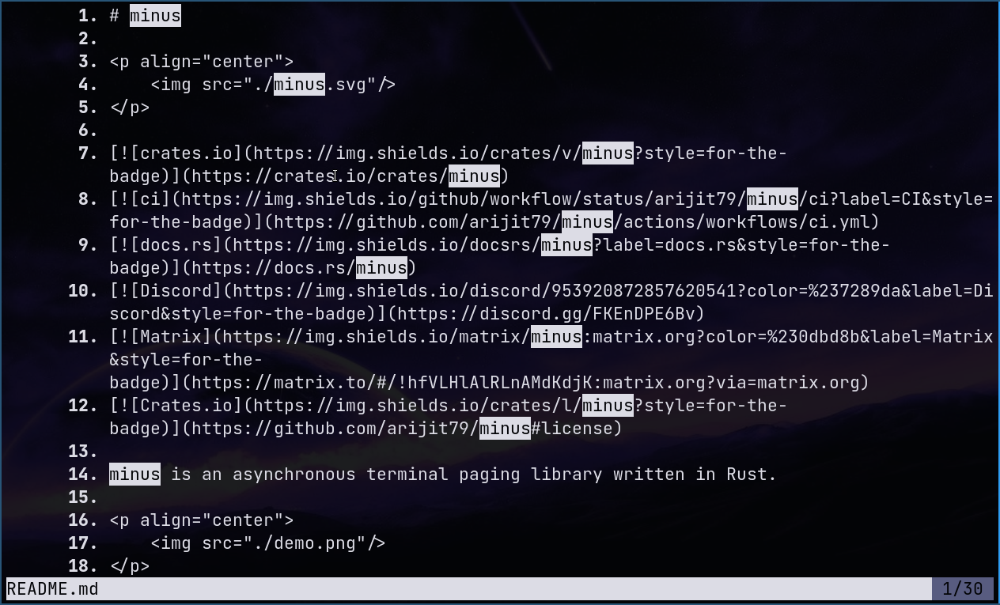

# minus

<p align="center">
    
</p>

[](https://crates.io/crates/minus)
[](https://github.com/arijit79/minus/actions/workflows/ci.yml)
[](https://docs.rs/minus)
[](https://discord.gg/FKEnDPE6Bv)
[](https://matrix.to/#/!hfVLHlAlRLnAMdKdjK:matrix.org?via=matrix.org)
[](https://github.com/arijit79/minus#license)

`minus`: A library for asynchronous terminal [paging], written in Rust.

<p align="center">
    
</p>

## Motivation
Traditional pagers like `more` or `less` weren't made for integrating into other applications. They were meant to
be standalone binaries that are executed directly by users. However most applications don't adhere to this and 
exploit these pagers' functionality by calling them as external programs and passing the data through the standard input.
This method worked for Unix and other Unix-like OSs like Linux and MacOS because they already came with any of these
pagers installed. But it wasn't this easy on Windows; it required shipping the pager binary along with the applications.
Since these programs were originally designed for Unix and Unix-like OSs, distributing these binaries meant shipping an
entire environment like MinGW or Cygwin so that these can run properly on Windows.

Recently, some libraries have emerged to solve this issue. They are compiled along with your application and give you a
single binary to distribute. The problem with them is that they require you to feed the entire data to the pager before
the pager can run, this meant that there will be no output on the terminal until the entire data is loaded by the
application and passed on to the pager.

These could cause long delays before output to the terminal if the data comes from a very large file or is being
downloaded from the internet.

## Features
- Send data as well as configure the pager on the fly.  
    This means that your data can be shown on the pager's screen as soon as it is loaded by your application. But not only that,
    you can also configure the minus while its running.
- Supports separate modes for dynamic and static output display  
    This separation of modes allows us to do some cool tricks in static mode. For example in static mode, if the terminal has 
    enough rows to display all the data at once then minus won't even start the pager and write all the data to the screen and quit. 
    (Of course this behaviour can be avoided if you don't like it).
    Similarly, in static mode if the output is piped using the `|` or sent to a file using the `>`/`>>`, minus would simply pass the 
    data as it is without starting the pager.
- Highly configurable  
    You can configure terminal key/mouse mappings, line numbers, bottom prompt line and more with a simple and clean API.
- Good support for ANSI escape sequences
- Both keyboard and mouse support  
    Key bindings highly inspired by Vim and other modern text editors
- Clutter free line numbering
- Horizontal scrolling
    Scroll not only up or down but also left and right.  
    **NOTE: ANSI escape codes are broken when scrolling horizontally which means as you scroll along the axis, you may see broken
    colors, emphasis etc. This is not a minus-specific problem but rather its how terminals behave and is inherently limited because of their design**
- Follow output mode  
    This feature ensures that you always see the last line as the data is being pushed onto the pager's buffer.
- Full [regex](https://docs.rs/regex) based searching.  
	Which also fully takes care of escape sequences. Also supports incremental searching of text as you type.
- Tries to be very minimal on dependencies.
- Is designed to be used with [`tokio`], [`async-std`] or native [`threads`] as you like.

## Usage

Add minus as a dependency in your `Cargo.toml` file and enable features as you like.

* If you only want a pager to display static data, enable the `static_output` feature

* If you want a pager to display dynamic data and be configurable at runtime, enable the `dynamic_output` feature

* If you want search support inside the pager, you need to enable the `search` feature

```toml
[dependencies.minus]
version = "5.6"
features = [
    # Enable features you want. For example
    "dynamic_output",
    "search",
]
```

## Examples

You can try the provided examples in the `examples` directory by using `cargo`:
```bash
cargo run --example <example name> --features=<required-features>

# for example to try the `dyn_tokio` example
cargo run --example dyn_tokio --features=dynamic_output,search
```

See [the docs](https://docs.rs/minus/latest/minus/#examples) for a summary of examples.


## Standard keyboard and mouse bindings

Can be seen [in the docs](https://docs.rs/minus/latest/minus/#standard-actions).

## MSRV
The latest version of minus requires Rust >= 1.67 to build correctly.

## License

Unless explicitly stated, all works to `minus` are dual licensed under the
[MIT License](./LICENSE-MIT) and [Apache License 2.0](./LICENSE-APACHE).

## Contributing
Issues and pull requests are more than welcome.
See [CONTRIBUTING.md](CONTRIBUTING.md) on how to contribute to `minus`.

## Thanks

minus would never have been this without the :heart: from these kind people

<a href="https://github.com/arijit79/minus/graphs/contributors">
  
</a>

And the help from these projects:-
- [crossterm](https://crates.io/crates/crossterm): An amazing library for working with terminals.
- [textwrap](https://crates.io/crates/textwrap): Support for text wrapping.
- [thiserror](https://crates.io/crates/thiserror): Helps in defining custom errors types.
- [regex](https://crates.io/crates/regex): Regex support when searching.
- [crossbeam-channel](https://crates.io/crates/crossbeam-channel): MPMC channel
- [parking_lot](https://crates.io/crates/parking_lot): Improved atomic storage types
- [once_cell](https://crates.io/crates/once_cell): Provides one-time initialization types.
- [tokio](https://crates.io/crates/tokio): Provides runtime for async examples.

## Get in touch

We are open to discussion and thoughts om improving `minus`. Join us at 
[Discord](https://discord.gg/FKEnDPE6Bv) or
[Matrix](https://matrix.to/#/!hfVLHlAlRLnAMdKdjK:matrix.org?via=matrix.org).

[`tokio`]: https://crates.io/crates/tokio
[`async-std`]: https://crates.io/crates/async-std
[`Threads`]: https://doc.rust-lang.org/std/thread/index.html
[paging]: https://en.wikipedia.org/wiki/Terminal_pager
